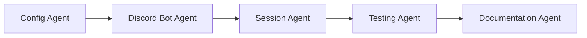
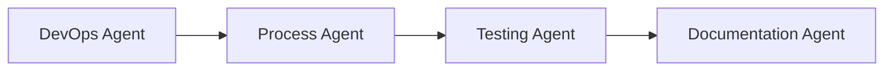
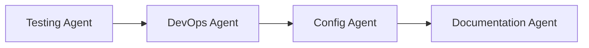

# Claude Code Specialized Agents

This directory contains specialized agent configurations for the Claude-Discord Bridge project. Each agent is optimized for specific aspects of the codebase, enabling focused and efficient development.

## Available Agents

### 1. 🎮 [Discord Bot Agent](./discord-bot-agent.md)
**Focus**: Discord integration, slash commands, and UI components
- Handles Discord API interactions
- Manages slash commands and interactive components
- Formats messages and embeds

### 2. 📊 [Session Management Agent](./session-manager-agent.md)
**Focus**: Claude session lifecycle and persistence
- Creates and manages sessions
- Implements database persistence
- Handles session restoration and cleanup

### 3. ⚙️ [Process Management Agent](./process-manager-agent.md)
**Focus**: Claude CLI process management
- Manages tmux and PTY backends
- Handles process I/O streams
- Implements fallback strategies

### 4. 📝 [Output Processing Agent](./output-parser-agent.md)
**Focus**: Parsing and formatting Claude output
- Parses various output types
- Formats for Discord display
- Handles streaming updates

### 5. 🚀 [DevOps Agent](./devops-agent.md)
**Focus**: Deployment, monitoring, and operations
- System diagnostics and health checks
- Deployment automation
- Performance monitoring

### 6. ⚙️ [Configuration Agent](./config-agent.md)
**Focus**: Environment and configuration management
- Manages environment variables
- Validates configuration
- Implements feature flags

### 7. 🧪 [Testing Agent](./testing-agent.md)
**Focus**: Test creation and maintenance
- Writes unit and integration tests
- Maintains test coverage
- Mocks external dependencies

### 8. 📚 [Documentation Agent](./documentation-agent.md)
**Focus**: Project documentation
- Maintains README and guides
- Documents APIs and configuration
- Creates troubleshooting guides

## Using Agents with Claude Code

### Quick Usage
When working with Claude Code, you can request a specific agent by mentioning the relevant area:

```
"Help me add a new Discord slash command" → Discord Bot Agent
"Fix the session persistence issue" → Session Management Agent
"Optimize the output parsing" → Output Processing Agent
"Deploy to AWS" → DevOps Agent
```

### Direct Agent Invocation
You can also explicitly request an agent:

```
"Use the Discord Bot Agent to implement a new button handler"
"Use the Testing Agent to write tests for the session manager"
```

### Agent Handoffs
For complex tasks spanning multiple domains, agents can be used sequentially:

1. Configuration Agent → Set up new environment variables
2. Discord Bot Agent → Implement new command using those variables
3. Testing Agent → Write tests for the new feature
4. Documentation Agent → Update README with new command

## Agent Coordination Patterns

### Feature Implementation Flow


### Bug Fix Flow


### Deployment Flow


## Best Practices

### 1. Choose the Right Agent
- Match the agent to your task domain
- Use specialized agents for focused work
- Combine agents for complex features

### 2. Provide Context
When invoking an agent, provide:
- Current issue or feature request
- Relevant file paths
- Any error messages
- Desired outcome

### 3. Agent Boundaries
Each agent has clear responsibilities:
- Don't ask Discord Bot Agent about database schemas
- Don't ask Testing Agent to deploy code
- Use the right tool for the job

### 4. Sequential Tasks
For multi-step tasks:
1. Plan the sequence of agents needed
2. Complete one agent's work before moving to the next
3. Pass relevant context between agents

## Common Workflows

### Adding a New Feature
1. **Configuration Agent**: Define required environment variables
2. **Discord Bot Agent**: Implement Discord interface
3. **Session Management Agent**: Add session handling if needed
4. **Output Processing Agent**: Format responses appropriately
5. **Testing Agent**: Write comprehensive tests
6. **Documentation Agent**: Update all relevant docs

### Debugging an Issue
1. **DevOps Agent**: Run diagnostics
2. **Process Management Agent**: Check process health
3. **Session Management Agent**: Verify session state
4. **Testing Agent**: Write reproduction test
5. **Documentation Agent**: Document the fix

### Performance Optimization
1. **DevOps Agent**: Identify bottlenecks
2. **Process Management Agent**: Optimize process handling
3. **Output Processing Agent**: Streamline parsing
4. **Testing Agent**: Add performance tests

## Agent Capabilities Matrix

| Agent | Read | Write | Test | Deploy | Config |
|-------|------|-------|------|--------|--------|
| Discord Bot | ✅ | ✅ | ❌ | ❌ | ❌ |
| Session Manager | ✅ | ✅ | ❌ | ❌ | ❌ |
| Process Manager | ✅ | ✅ | ❌ | ❌ | ❌ |
| Output Parser | ✅ | ✅ | ❌ | ❌ | ❌ |
| DevOps | ✅ | ✅ | ✅ | ✅ | ✅ |
| Configuration | ✅ | ✅ | ❌ | ❌ | ✅ |
| Testing | ✅ | ✅ | ✅ | ❌ | ❌ |
| Documentation | ✅ | ✅ | ❌ | ❌ | ❌ |

## Maintenance

### Adding New Agents
1. Create agent configuration file: `.claude/agents/[agent-name].md`
2. Define role, responsibilities, and primary files
3. Document patterns and best practices
4. Update this README with the new agent

### Updating Agents
- Keep agent docs synchronized with code changes
- Update file paths when restructuring
- Add new patterns as they emerge
- Document common issues and solutions

## Tips for Claude Code Users

1. **Be Specific**: Tell Claude which agent perspective you need
2. **Provide Context**: Share relevant error messages or requirements
3. **Use Examples**: Reference existing patterns in the codebase
4. **Iterate**: Start with one agent, then bring in others as needed
5. **Document**: Ask the Documentation Agent to capture new patterns

## Feedback

These agent configurations are living documents. As the project evolves:
- Update agent responsibilities
- Add new patterns and examples
- Document lessons learned
- Share successful workflows

Remember: The agents are here to help you work more efficiently with the Claude-Discord Bridge codebase. Use them as specialized assistants, each expert in their domain.