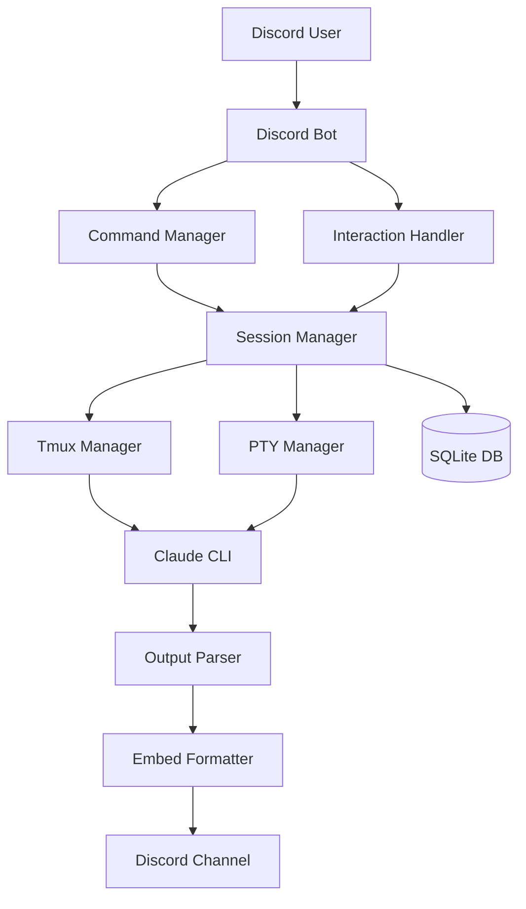

# Claude-Discord Bridge 🤖

[](https://nodejs.org)
[](https://discord.js.org)
[](LICENSE)
[](https://www.typescriptlang.org/)

A powerful Discord bot that bridges Claude Code CLI with Discord, providing a rich interactive interface for AI-powered coding assistance directly in your Discord server.


## ✨ Features

### 🎮 Rich Interactive Components
- **Smart Control Panels** - Every response includes interactive buttons (Continue, Regenerate, Stop, Branch, Debug)
- **Dynamic Select Menus** - Switch between Claude models, projects, and sessions on the fly
- **Code Input Modals** - Submit code with instructions through beautiful Discord modals
- **Live Progress Indicators** - Real-time feedback while Claude processes your requests
- **Session Dashboard** - Visual overview and management of all active sessions

### 🚀 Core Capabilities
- **Multi-Session Support** - Handle multiple concurrent Claude sessions
- **Persistent Storage** - SQLite database preserves sessions across restarts
- **Tmux Integration** - Robust session management with tmux (PTY fallback available)
- **Thread Support** - Automatic Discord thread creation for organized conversations
- **File Attachments** - Share code files and images directly with Claude
- **Streaming Responses** - Real-time output streaming from Claude CLI
- **Smart Output Parsing** - Intelligent formatting of code blocks, lists, and responses

### 💰 Cost Effective
- **Fixed Monthly Cost** - Leverages your Claude Code CLI subscription ($20-200/month)
- **No API Usage Fees** - Unlimited usage within your subscription limits
- **Predictable Billing** - No surprise costs or token counting

## 📋 Prerequisites

- **Node.js 18+** - [Download](https://nodejs.org/)
- **Claude Code CLI** - [Get subscription](https://claude.ai/code)
- **Discord Bot Token** - [Create application](https://discord.com/developers/applications)
- **Tmux** (recommended) - For robust session management
  ```bash
  # Ubuntu/Debian
  sudo apt-get install tmux
  
  # macOS
  brew install tmux
  
  # Windows (WSL)
  sudo apt-get install tmux
  ```

## 🚀 Quick Start

### 1. Clone & Install

```bash
# Clone the repository
git clone https://github.com/yourusername/claude-discord-bridge.git
cd claude-discord-bridge

# Install dependencies
npm install

# Initialize database
npm run db:init
```

### 2. Configure

```bash
# Copy environment template
cp .env.example .env

# Edit configuration
nano .env
```

Required configuration in `.env`:
```env
# Discord Configuration (REQUIRED)
DISCORD_TOKEN=your_bot_token_here
DISCORD_CLIENT_ID=your_client_id_here

# Optional: Restrict to specific guild for testing
DISCORD_GUILD_ID=your_guild_id_here

# Optional: Restrict access
ALLOWED_USER_IDS=user_id_1,user_id_2
```

### 3. Discord Bot Setup

1. Go to [Discord Developer Portal](https://discord.com/developers/applications)
2. Create a new application
3. Navigate to **Bot** section
4. Copy token to `.env` file
5. Enable required intents:
   - ✅ MESSAGE CONTENT INTENT
   - ✅ SERVER MEMBERS INTENT
6. Navigate to **OAuth2 → URL Generator**
7. Select scopes:
   - `bot`
   - `applications.commands`
8. Select permissions:
   - Send Messages
   - Use Slash Commands
   - Embed Links
   - Attach Files
   - Read Message History
   - Add Reactions
   - Manage Threads
9. Use generated URL to invite bot to your server

### 4. Register Commands & Start

```bash
# Register Discord slash commands
npm run register

# Start the bot
npm start

# Or run in development mode with auto-reload
npm run dev
```

## 📖 Usage

### Complete Command Reference

#### 💬 **Claude Interaction** (`/claude`)
Primary command for interacting with Claude Code CLI.

| Subcommand | Description | Options |
|------------|-------------|---------|
| `/claude chat` | Start or continue a conversation | `message`, `model`, `project` |
| `/claude continue` | Continue the current conversation | - |
| `/claude regenerate` | Regenerate the last response | `feedback` |
| `/claude stop` | Stop the current operation | - |
| `/claude branch` | Create a conversation branch | `name` |
| `/claude model` | Switch Claude model | `model` |

#### 💻 **Code Operations** (`/code`)
Specialized commands for working with code.

| Subcommand | Description | Options |
|------------|-------------|---------|
| `/code review` | Submit code for review | `file` attachment |
| `/code fix` | Fix errors in code | `error` description |
| `/code refactor` | Refactor for better quality | `goal` |
| `/code explain` | Get detailed explanation | - |
| `/code test` | Generate test cases | `framework` |
| `/code document` | Generate documentation | `style` |
| `/code convert` | Convert to another language | `language` |

#### 📊 **Session Management** (`/session`)
Manage your Claude sessions and conversation history.

| Subcommand | Description | Options |
|------------|-------------|---------|
| `/session list` | List all your sessions | `detailed` |
| `/session info` | Current session information | - |
| `/session switch` | Switch to different session | `id` |
| `/session rename` | Rename current session | `name` |
| `/session clear` | Clear session history | `target` |
| `/session export` | Export session data | `format` |
| `/session import` | Import session from file | `file` |
| `/session stats` | View statistics | `period` |
| `/session history` | View conversation history | `limit` |

#### 📁 **Project Workspace** (`/project`)
Manage project directories and workspaces.

| Subcommand | Description | Options |
|------------|-------------|---------|
| `/project create` | Create new project | `name`, `template` |
| `/project list` | List available projects | - |
| `/project open` | Open project workspace | `name` |
| `/project files` | List project files | `path` |
| `/project run` | Run project command | `command` |

#### 🔧 **Tools Control** (`/tools`)
Control Claude's tool usage and capabilities.

| Subcommand | Description | Options |
|------------|-------------|---------|
| `/tools enable` | Enable specific tool | `tool` |
| `/tools disable` | Disable specific tool | `tool` |
| `/tools list` | List tools and status | - |

#### ⚙️ **Settings** (`/settings`)
Configure your personal preferences.

| Subcommand | Description | Options |
|------------|-------------|---------|
| `/settings view` | View current settings | - |
| `/settings model` | Set default model | `model` |
| `/settings notifications` | Configure notifications | `enabled` |
| `/settings threads` | Configure auto-threading | `enabled` |
| `/settings streaming` | Configure streaming | `enabled` |

#### 👮 **Admin Commands** (`/admin`)
Administrative commands (requires admin permissions).

| Subcommand | Description | Options |
|------------|-------------|---------|
| `/admin status` | System health check | - |
| `/admin sessions` | View all active sessions | - |
| `/admin cleanup` | Clean inactive sessions | `age` |
| `/admin restart` | Restart backend services | `type` |
| `/admin config` | View/reload configuration | `action` |
| `/admin logs` | View system logs | `level`, `lines` |

#### ❓ **Help** (`/help`)
Get help and documentation.

| Option | Description |
|--------|-------------|
| `topic` | Specific help topic (optional) |

Available topics: Getting Started, Commands, Sessions, Code Features, Projects, Shortcuts, Troubleshooting

### Interactive Components

Every Claude response includes an interactive control panel:

- **▶️ Continue** - Continue the conversation from where it left off
- **🔄 Regenerate** - Regenerate the last response with different output
- **⏹️ Stop** - Stop the current operation
- **🌿 Branch** - Create a new conversation branch from current point
- **🐛 Debug** - View debug information for the session

### Mention Commands

You can also interact with the bot by mentioning it:

```
@Claude explain this code: function fibonacci(n) { ... }
@Claude help me fix this error: TypeError: undefined is not a function
@Claude refactor this for better performance
```

### Reaction Shortcuts

When enabled, you can use reactions for quick actions:
- 👍 or ▶️ - Continue
- 🔄 - Regenerate
- ⏹️ or 👎 - Stop

## ⚙️ Configuration

### Environment Variables

See [.env.example](.env.example) for all available options:

| Variable | Description | Default |
|----------|-------------|---------|
| `CLAUDE_CLI_PATH` | Path to Claude Code CLI | `claude-code` |
| `SESSION_TYPE` | Session manager type | `tmux` |
| `PROJECT_BASE_PATH` | Base path for projects | `~/claude-projects` |
| `MAX_SESSIONS` | Maximum concurrent sessions | `10` |
| `DEFAULT_TIMEOUT` | Session timeout (seconds) | `300` |
| `ENABLE_STREAMING` | Enable real-time streaming | `true` |
| `ENABLE_THREADING` | Auto-create Discord threads | `true` |
| `ENABLE_PERSISTENCE` | Save sessions to database | `true` |
| `REACTION_SHORTCUTS` | Enable reaction controls | `true` |

### Advanced Features

#### Project Workspace Mapping

Map Discord channels to specific project directories:

```env
# In your .env
PROJECT_MAPPINGS=channel_id_1:~/projects/webapp,channel_id_2:~/projects/api
```

#### Model Configuration

Configure available Claude models:

```javascript
// In src/config.ts
models: {
  'opus': 'claude-3-opus',
  'sonnet': 'claude-3-sonnet',
  'haiku': 'claude-3-haiku'
}
```

## 🏗️ Architecture



### Key Components

- **Session Manager** - Orchestrates multiple Claude sessions with persistence
- **Tmux Manager** - Primary session handler using tmux for reliability
- **PTY Manager** - Fallback session handler for non-tmux environments
- **Output Parser** - Intelligently parses and formats Claude's responses
- **Component Handler** - Manages all Discord interaction components
- **Command System** - Modular slash command implementation

## 🔧 Development

### Project Structure

```
claude-discord-bridge/
├── src/
│   ├── index.ts              # Main entry point
│   ├── config.ts             # Configuration management
│   ├── claude/               # Claude integration
│   │   ├── session-manager.ts
│   │   ├── session.ts
│   │   ├── tmux-manager.ts
│   │   ├── pty-manager.ts
│   │   └── output-parser.ts
│   ├── discord/              # Discord integration
│   │   └── commands.ts
│   ├── interactions/         # Component handlers
│   │   └── component-handler.ts
│   └── utils/                # Utilities
│       └── logger.ts
├── scripts/                  # Setup and maintenance scripts
│   ├── install.sh
│   ├── register-commands.ts
│   ├── init-db.ts
│   └── doctor.ts
├── data/                     # Database storage
├── logs/                     # Application logs
└── docs/                     # Documentation
```

### Available Scripts

| Script | Description |
|--------|-------------|
| `npm start` | Start bot in production mode |
| `npm run dev` | Start bot in development mode with auto-reload |
| `npm run build` | Compile TypeScript to JavaScript |
| `npm run lint` | Run ESLint on source files |
| `npm run format` | Format code with Prettier |
| `npm test` | Run test suite |
| `npm run db:init` | Initialize SQLite database |
| `npm run doctor` | Run system diagnostic checks |
| `npm run register` | Register Discord slash commands |

### Running Tests

```bash
# Run all tests
npm test

# Run with coverage
npm run test:coverage

# Run in watch mode
npm run test:watch
```

## 🚀 Deployment

### Local Deployment

Perfect for personal use or small teams:

```bash
# Use PM2 for process management
npm install -g pm2
pm2 start dist/index.js --name claude-discord
pm2 save
pm2 startup
```

### VPS Deployment

See [DEPLOYMENT.md](docs/DEPLOYMENT.md) for detailed VPS deployment guide.

### Docker Deployment

```bash
# Build Docker image
docker build -t claude-discord-bridge .

# Run container
docker run -d \
  --name claude-discord \
  --env-file .env \
  -v $(pwd)/data:/app/data \
  -v $(pwd)/logs:/app/logs \
  claude-discord-bridge
```

### Cloud Deployment

Supported platforms:
- **AWS EC2** - [Guide](docs/deployment/aws.md)
- **Google Cloud Platform** - [Guide](docs/deployment/gcp.md)
- **Azure** - [Guide](docs/deployment/azure.md)
- **DigitalOcean** - [Guide](docs/deployment/digitalocean.md)

## 🔍 Troubleshooting

### System Diagnostics

Run the built-in diagnostic tool:

```bash
npm run doctor
```

This checks:
- Node.js version compatibility
- Discord token configuration
- Claude CLI availability
- Tmux installation
- Database initialization
- Directory permissions
- Dependency installation

### Common Issues

#### Bot Not Responding
- Verify bot is online in Discord
- Check token in `.env` file
- Review logs: `tail -f logs/bot.log`
- Ensure bot has proper permissions in server

#### Commands Not Appearing
- Run `npm run register`
- For global commands, wait up to 1 hour
- Use guild-specific commands for instant updates
- Verify `DISCORD_CLIENT_ID` is correct

#### Claude CLI Not Found
- Verify Claude Code is installed: `which claude-code`
- Update `CLAUDE_CLI_PATH` in `.env`
- Ensure PATH includes Claude installation directory

#### Session Issues
- Check tmux is installed: `tmux -V`
- Try PTY mode: `SESSION_TYPE=pty`
- Verify database: `npm run db:init`
- Check disk space for database storage

### Debug Mode

Enable verbose logging:

```env
LOG_LEVEL=debug
```

Monitor logs:

```bash
# Real-time log monitoring
tail -f logs/bot.log

# View error logs only
tail -f logs/error-*.log

# Search logs
grep "session" logs/bot-*.log
```

## 📊 Monitoring

### Built-in Metrics

The bot tracks:
- Active sessions count
- Message processing time
- Command usage statistics
- Error rates
- Memory usage

View metrics:
```
/session stats
```

### External Monitoring

Integration guides:
- [Prometheus & Grafana](docs/monitoring/prometheus.md)
- [DataDog](docs/monitoring/datadog.md)
- [New Relic](docs/monitoring/newrelic.md)

## 🤝 Contributing

We welcome contributions! Please see [CONTRIBUTING.md](CONTRIBUTING.md) for details.

### Development Setup

1. Fork the repository
2. Create feature branch: `git checkout -b feature/AmazingFeature`
3. Make your changes
4. Run tests: `npm test`
5. Commit changes: `git commit -m 'Add AmazingFeature'`
6. Push to branch: `git push origin feature/AmazingFeature`
7. Open pull request

### Code Style

- TypeScript strict mode enabled
- ESLint for linting
- Prettier for formatting
- Conventional commits

## 📄 License

This project is licensed under the MIT License - see [LICENSE](LICENSE) file for details.

## 🙏 Acknowledgments

- [Discord.js](https://discord.js.org/) - Discord API wrapper
- [Claude by Anthropic](https://claude.ai) - AI assistant
- [node-pty](https://github.com/microsoft/node-pty) - PTY support
- [SQLite](https://www.sqlite.org/) - Database engine

## 📮 Support

- **Documentation**: [Full docs](docs/README.md)
- **Issues**: [GitHub Issues](https://github.com/yourusername/claude-discord-bridge/issues)
- **Discussions**: [GitHub Discussions](https://github.com/yourusername/claude-discord-bridge/discussions)
- **Discord**: [Join our server](https://discord.gg/yourinvite)

## 🗺️ Roadmap

- [ ] Web dashboard for session management
- [ ] Voice channel support
- [ ] Multi-language support
- [ ] Plugin system for custom tools
- [ ] Claude API fallback option
- [ ] Collaborative coding sessions
- [ ] Code execution sandboxing
- [ ] Git integration

## ⭐ Star History

[](https://star-history.com/#yourusername/claude-discord-bridge&Date)

---

<p align="center">Made with ❤️ by the Claude-Discord Bridge Team</p>
<p align="center">
  <a href="https://github.com/yourusername/claude-discord-bridge">GitHub</a> •
  <a href="https://discord.gg/yourinvite">Discord</a> •
  <a href="docs/README.md">Documentation</a>
</p>